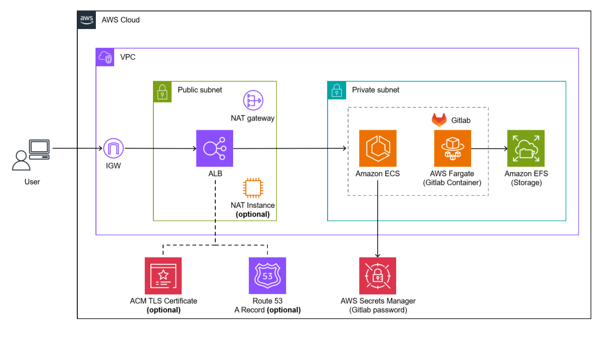
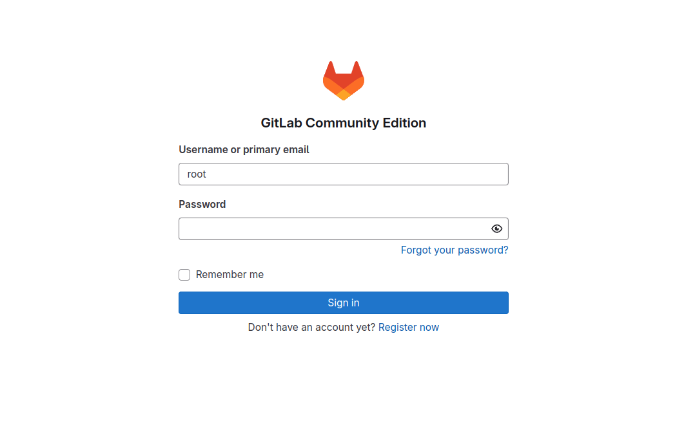

# GitLab Deployment Using AWS CDK

> Note
> 日本語ドキュメントは[こちら](./README_ja.md)にあります。

Self-host [GitLab](https://about.gitlab.com/) on AWS managed services using AWS CDK as an alternative to CodeCommit.



## Key Features

- Minimal maintenance overhead using fully managed services
  - Leverages ECS Fargate and EFS
- Cost-efficient architecture design
  - Option to use NAT instances instead of NAT Gateway
- Seamless integration with existing AWS resources
  - Ability to host GitLab within existing VPC
  - Support for existing domain names

## Prerequisites

The following dependencies must be installed to deploy this application:

- [Node.js](https://nodejs.org/en/download/package-manager) (v22 or later)
- [AWS CDK](https://docs.aws.amazon.com/cdk/v2/guide/work-with-cdk-typescript.html) (v2 or later)
- [AWS CLI](https://docs.aws.amazon.com/cli/latest/userguide/getting-started-install.html) and an IAM profile with `Administrator policy`

## Deployment

> [!IMPORTANT]
> For detailed deployment parameter configuration, please refer to [this guide](./docs/DEPLOY_OPTION.md).

> [!TIP]
> For deployment using CloudShell, please refer to [this guide](./docs/DEPLOY_ON_CLOUDSHELL.md).

You can adjust configuration parameters such as AWS region by editing `bin/aws-cdk-gitlab-on-ecs.ts`. For all available parameters, please also check the [`GitlabServerlessStackProps`](./lib/aws-cdk-gitlab-on-ecs-stack.ts) interface.

Then, you can deploy the entire stack by running the following commands from the repository root:

```sh
# install npm dependencies
npm ci
# bootstrap the AWS account (required only once per account and region)
npx cdk bootstrap
# deploy the CDK stack
npx cdk deploy
```

Initial deployment typically takes around 20 minutes. After a successful deployment, you will get the URL for the application:

```
 ✅  GitlabServerlessStack
✨  Deployment time: 1003.7s
Outputs:
GitlabServerlessStack.GitlabUrl = https://gitlab.example.com
Stack ARN:
arn:aws:cloudformation:ap-northeast-1:XXXXXXXXXXXX:stack/GitlabServerlessStack/5901fab0-a4e6-11ef-9796-0e94afb0bd61
✨  Total time: 1006.43s
```

## Signing in to GitLab

The default administrator username is `root`. The password is stored in Secrets Manager and is a randomly generated string created during deployment.



## Cleanup

Execute the following command. Please note that this will delete all resources, including the EFS (storage for GitLab repositories):

```sh
npx cdk destroy --force
```

## Acknowledgments

The implementation of this CDK was inspired by the following repositories and resources:

- [aws-samples/dify-self-hosted-on-aws](https://github.com/aws-samples/dify-self-hosted-on-aws)
- [aws-samples/generative-ai-use-cases-jp](https://github.com/aws-samples/generative-ai-use-cases-jp)
- [AWS CDK Best Practices for Beginners 2024](https://speakerdeck.com/konokenj/cdk-best-practice-2024)
- [Thinking About "Reusability" in AWS CDK](https://speakerdeck.com/gotok365/aws-cdk-reusability)
- [Addressing Common AWS CDK Concerns](https://speakerdeck.com/tmokmss/answering-cdk-faqs)
- [Learning When to Use Unit Tests in AWS CDK](https://aws.amazon.com/jp/builders-flash/202411/learn-cdk-unit-test/)
- [Best Practices for Developing Cloud Applications with AWS CDK](https://aws.amazon.com/jp/blogs/news/best-practices-for-developing-cloud-applications-with-aws-cdk/)
