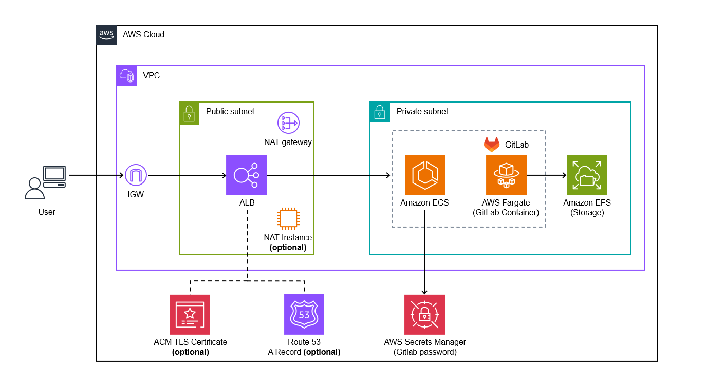
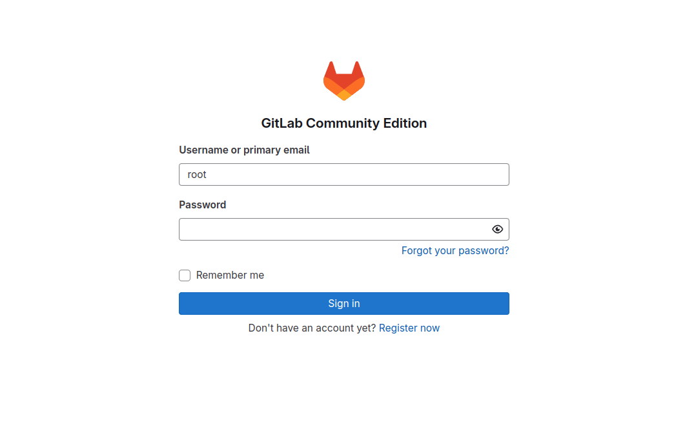

# AWS CDK による GitLab の構築

CodeCommit の代替として，AWS CDK を利用し，[GitLab](https://about.gitlab.com/)を AWS マネージドサービス上でセルフホストします．



## 特徴

- メンテナンスの労力が少ないフルマネージドサービスを採用
  - ECS Fargate, EFS を使用
- コスト効率の良いアーキテクチャ設計
  - NAT Gateway の代わりに NAT インスタンスの使用が可能
- 既存の AWS リソースとの連携
  - 既存の VPC 内で GitLab をホスト構築可能
  - 既存のドメインの使用が可能

## 前提条件

本アプリをデプロイするには，以下の依存関係がインストールされている必要があります．

- [Node.js](https://nodejs.org/en/download/package-manager) (v22 以降)
- [AWS CDK](https://docs.aws.amazon.com/cdk/v2/guide/work-with-cdk-typescript.html) (v2 以降)
- [AWS CLI](https://docs.aws.amazon.com/cli/latest/userguide/getting-started-install.html) と `Administrator policy` を持つ IAM プロファイル

## デプロイ

> [!IMPORTANT]
> デプロイ時のパラメータの設定方法については，[こちら](./docs/DEPLOY_OPTION_ja.md)を参照してください．

> [!TIP]
> CloudShell でデプロイする場合は，[こちら](./docs/DEPLOY_ON_CLOUDSHELL_ja.md)を参照してください．

`bin/aws-cdk-gitlab-on-ecs.ts` を編集することで，AWS リージョンなどの設定パラメータを調整できます．利用可能なすべてのパラメータについては [`GitlabServerlessStackProps`](./lib/aws-cdk-gitlab-on-ecs-stack.ts) インターフェースも確認してください．

その後，以下のコマンドを実行してスタック全体をデプロイできます．なお，コマンドはリポジトリのルートで実行してください．

```sh
# install npm dependencies
npm ci
# bootstrap the AWS account (required only once per account and region)
npx cdk bootstrap
# deploy the CDK stack
npx cdk deploy
```

初回のデプロイには通常約 20 分かかります．デプロイが成功すると，アプリケーションの URL が表示されます．

```
 ✅  GitlabServerlessStack

✨  Deployment time: 1003.7s

Outputs:
GitlabServerlessStack.GitlabUrl = https://gitlab.example.com
Stack ARN:
arn:aws:cloudformation:ap-northeast-1:XXXXXXXXXXXX:stack/GitlabServerlessStack/5901fab0-a4e6-11ef-9796-0e94afb0bd61

✨  Total time: 1006.43s
```

## GitLab へのサインイン

デフォルトの管理者ユーザー名は`root`です．パスワードは Secrets Manager に保存されており，デプロイ時に生成されたランダムな文字列です．



## リソースの削除方法

以下のコマンドを実行します．EFS（Gitlab のリポジトリ用のストレージ）を含む全てのリソースが削除される点にご注意下さい．

```sh
npx cdk destroy --force
```

## 謝辞

本 CDK の実装を行うにあたり，以下のリポジトリや資料を参考にさせていただきました．

- [aws-samples/dify-self-hosted-on-aws](https://github.com/aws-samples/dify-self-hosted-on-aws)
- [aws-samples/generative-ai-use-cases-jp](https://github.com/aws-samples/generative-ai-use-cases-jp)
- [初心者がおさえておきたい AWS CDK のベストプラクティス 2024](https://speakerdeck.com/konokenj/cdk-best-practice-2024)
- [AWS CDK における「再利用性」を考える](https://speakerdeck.com/gotok365/aws-cdk-reusability)
- [AWS CDK のあるあるお悩みに答えたい](https://speakerdeck.com/tmokmss/answering-cdk-faqs)
- [AWS CDK における単体テストの使い所を学ぶ](https://aws.amazon.com/jp/builders-flash/202411/learn-cdk-unit-test/)
- [AWS CDK でクラウドアプリケーションを開発するためのベストプラクティス](https://aws.amazon.com/jp/blogs/news/best-practices-for-developing-cloud-applications-with-aws-cdk/)
